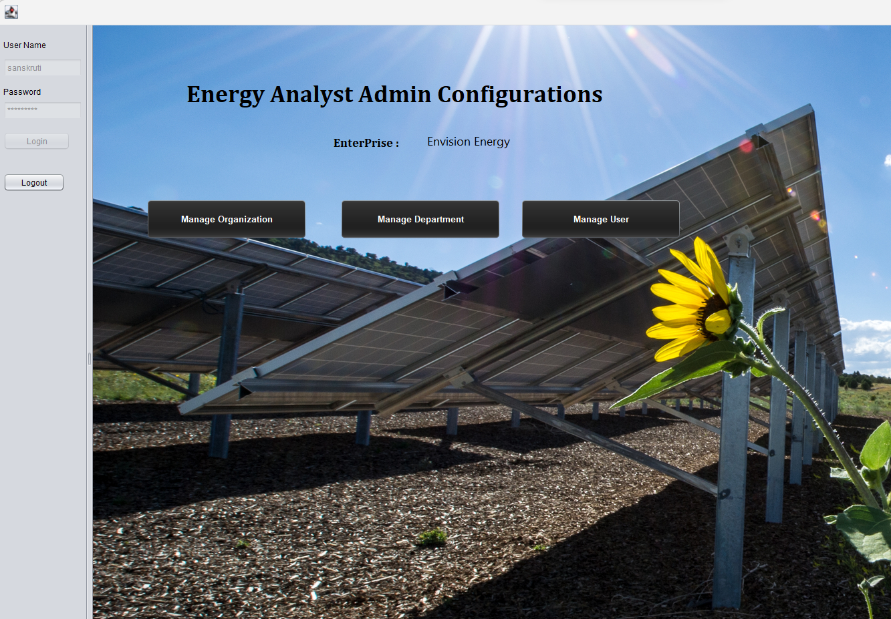
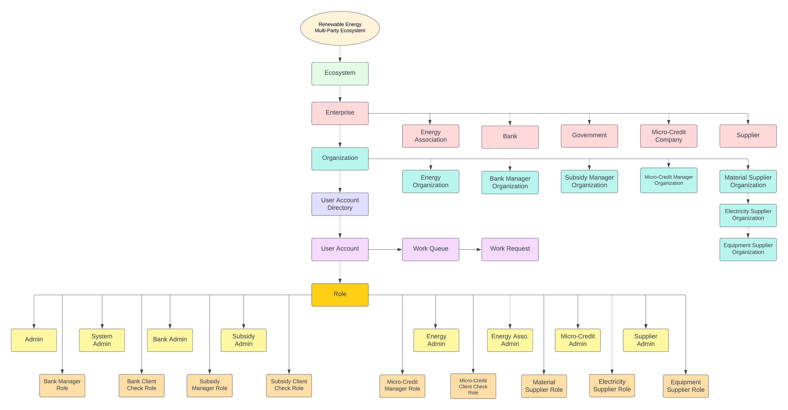

App name - Radiance  

   
   
   

Summary  
 
This report outlines the design and implementation of an online renewal sources of energy platform where energy analysts can register and request resource to build up their industrial platform. They can request loans, supplies, subsidy from this platform and keep track of their requests.  
Introduction    
Application Architecture  
Class Diagram  
Key Features Use Cases  
Technology Stack  
Instructions to run the project  
 

1.	Introduction  
 
◾Radiance offers seamless cross-party integration, breaking down data silos and providing a centralized platform where stakeholders can collaborate, share data, and make informed decisions.  
◾	Radiance ensures all stakeholders adhere to the latest industry compliance regulations through strict validations throughout the platform.  
◾	The most important feature of Radiance is that it can establish connections between renewable energy production companies and financial institutions, thus streamlining the financing process and increasing transparency to attract potential investors.  
◾	Our ecosystem helps businesses optimize loan application process, procurement process, monitor shipping and enhance overall efficiency of the supply chain.  
◾	A dashboard report is available that involves real time monitoring of users who sign up and top performers on the platform.  
◾	What is included in this project:  
Deliverables:  
-	A workflow application including 5 enterprises, 7 organisation and 16 user roles 
-	(including sub departments)  
-	Presentation explaining entire ide and implementation.  
-	Included Report dashboard of the application.  
-	User Authentication (login for each user role accounts)  
-	ConfigureASystem file for data. And DB Integration  
 
  
  
  
  

2.	Application Architecture  

The application is implemented in NetBeans and integrated with DBO4 database. It is divided into 5 business Modules:  
1.	Energy Association  
2.	Bank Enterprise  
3.	Government Enterprise  
4.	Micro-Credit Enterprise  
5.	Supplier Enterprise  

 
 
 

3.	Application Class Diagram  
Please find the detailed implementation of the application below in the form of class diagram -  

 

  
  
  
  
 
4.	Key Technical Features:  
 
 
1.	SMS Integration:  
Purpose: Enable the application to send SMS notifications to users for important events or updates for subsidy approval.
Integrated with an SMS gateway service (Twilio)  
2.	Report Dashboard:  
Purpose: Provide a visual representation of key metrics and data trends for users.  
3.	DB Integration:  
Purpose: Establish a connection between the application and a database to store and retrieve data such as DBO4
4.	Status Updation:  
Purpose: Keep users informed about the status of their requests or transactions. Implementation:
Update the status of requests in the database.  
5.	User Authentication:  
Purpose: Ensure secure access to the application and its features. Created a login flow of all the users in the application.  
6.	Two-Process Request Workflow:  
Purpose: Manage complex processes that require approval or verification from multiple stages, such as Client check has been done post managerial flow.   
7.	Document Upload and View Feature:  
Purpose: Allow users to upload and view documents within the application, such as proof of SSN , collateral etc.  
8.	Validations in Forms:  
Purpose: Ensure data integrity by validating user inputs on forms. Implementation, for example – phone number, email id of user. Implement client-side validations using JavaScript for immediate feedback.  
9.	Configuration File:  
Purpose: Centralize and manage application configuration settings.  
 
 
 
 
 

5.	Use Case (Application Workflow)  
  
1.	System Admin  
View/Add/Delete Ecosystem: 
Use Case: Access network information, add new networks, delete existing ecosystem. View/Add/Delete Enterprise:
Use Case: Access enterprise details, add new enterprises, delete existing enterprises. View/Add/Delete Enterprise Admin:
Use Case: Manage enterprise administrators, view, add, or delete enterprise admin accounts.
2.	Energy Enterprise Admin  
View/Add/Delete Energy Organization:  
Use Case: Access energy organization details, add new organizations, delete existing organizations.  
View/Add/Delete Energy:  
Use Case: Manage energy-related information, add new energy records, delete existing energy records.  
3.	Bank Enterprise Admin  
View/Add/Delete Bank Manager Organization/Bank Client Check Organization:  
Use Case: Access and manage bank manager and client check organizations, add new organizations, delete existing ones.  
View/Add/Delete Bank Manager/Bank Client Check Officer:  
Use Case: Manage bank managers and client check officers, add new accounts, delete existing accounts.  
4.	Micro-Credit Enterprise Admin  
View/Add/Delete Micro-Credit Manager Organization/Micro-Finance Client Check Organization:  
Use Case: Access and manage micro-finance manager and client check organizations, add new organizations, delete existing ones.  
View/Add/Delete Micro- Credit Manager/Micro-Finance Client Check Officer:  
Use Case: Manage micro- Credit managers and client check officers, add new accounts, delete existing accounts.  
5.	Government Enterprise Admin  
View/Add/Delete Subsidy Manager Organization/Subsidy Client Check Organization:  
Use Case: Access and manage subsidy manager and client check organizations, add new organizations, delete existing ones.  
View/Add/Delete Subsidy Manager/Subsidy Client Check Officer:  
Use Case: Manage subsidy managers and client check officers, add new accounts, delete existing accounts.  
6.	Supplier Admin  
View/Add/Delete Electricity Supplier Organization/Material Supplier Organization/Equipment Supplier Organization:  
Use Case: Access and manage supplier organizations for electricity, material, and equipment, add new organizations, delete existing ones.  
View/Add/Delete Electricity Supplier Department/Material Supplier Department/Equipment Supplier Department:
Use Case: Manage supplier departments, add new departments, delete existing ones.  
7.	Energy Role  
View Loan/Micro-loan/Orders:  
Use Case: Access and view loan, micro-loan, and order information. Apply Loan/Micro-loan/Order Supplies:  
Use Case: Apply for a loan or micro-loan, place orders for supplies.  
8.	Bank Manager  
View Loan Application:  
Use Case: Access and view loan applications. Refer Application for Client Check:  
Use Case: Forward loan applications for client check. Approve/Reject Loan Application:  
Use Case: Make decisions on loan applications.
9.	Client Check Officer  
View Loan Application:  
Use Case: Access and view loan applications. Approve/Reject Loan Application:  
Use Case: Make decisions on loan applications.  
10.	Micro-Credit Manager  
View Loan Application:    
Use Case: Access and view loan applications. Refer Application for Client Check:  
Use Case: Forward loan applications for client check. Approve/Reject Loan Application:  
Use Case: Make decisions on loan applications.  
11.	Micro-Credit Client Check Officer  
View Loan Application:  
Use Case: Access and view loan applications. Approve/Reject Loan Application:  
Use Case: Make decisions on loan applications.  
12.	Subsidy Manager  
View Subsidy Application:  
Use Case: Access and view subsidy applications. Refer Application for Client Check:  
Use Case: Forward subsidy applications for client check. Approve/Reject Loan Application/Subsidy:  
Use Case: Make decisions on subsidy applications.  
13.	Client Check Officer  
View Subsidy Application:  
Use Case: Access and view subsidy applications. Approve/Reject Loan Application/Subsidy:  
Use Case: Make decisions on subsidy applications.  
14.	Electricity Supply  
15.	Material Supply  
16.	Equipment Supply  
View Order:  
Use Case: Access and view order information. Ship/Reject Order:  
   
Use Case: Full fill or reject orders.  
 
 
 

6.	Technology Stack 
 
The platform is built using a modern technology stack, including:  
●	IDE : Netbeans   
●	Backend: Java 
●	Database : DBO4  
●	SMS Integration: Twilio  

 
 
 

